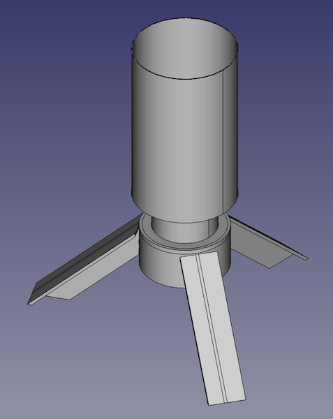

# lampy

> This project is still a work-in-progress.

## Inspiration

I have some spare bulb sockets and power cords.  Why not make some lamps out of them?

## Design

The concept is to strive for absolute minimalism and quick printing speed. _lampy_ re-uses the slotted-rails assembly concept [that I used on the dipole antenna project](https://github.com/ckuzma/dipole-antenna) for construction.  Three short legs slotted onto a one-piece "bulb holder" that is compatible with the types of standard E27/E26 bulb holders available at hardware stores, IKEA, and online.  It can then be paired with a lampshade of the user's choosing.

## Warning

Light bulbs can get very warm, especially the traditional incandescent kind.  Use of _lampy_ with anything but lower-wattage LED bulbs is **not** recommended.  Use of incandescent bulbs will likely lead to melted plastic, fire, property damage and/or personal injury.